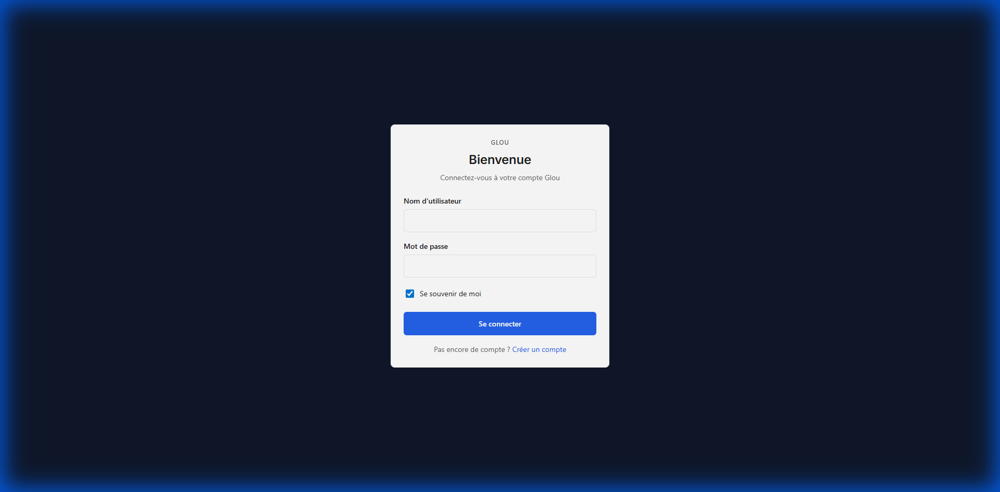

# Glou — Simply Precious

### Your private cellar concierge that keeps bottles, bubbles, spirits, and cigars perfectly organized while staying fully in your hands.



---

## ✨ Why Glou? (Highlights)

- 🍷 **Infinite Cellar & History** (FEAT-55): Manage thousands of bottles with persistent history. Every bottle is safely stored in PostgreSQL.
- 🚀 **Smart Consumption Suggestions** (FEAT-08): Too many choices? Let Glou suggest the perfect bottle based on maturity and your preferences.
- 📱 **Mobile & Offline Ready** (FEAT-58): Designed for any screen. Manage your cellar from the restaurant or deep in your basement.
- 🔐 **Secure & Private** (FEAT-02/03): Self-hosted, 2FA support, and complete data ownership. no tracking, no ads.
- 📊 **Dynamic Views** (FEAT-57): Visualize your collection your way—switch between grid and list views instantly.

---

## 🛠 Get Started in Seconds

### Prerequisites
- Docker & Docker Compose

### Launch
1. **Prepare the secret sauce** — create a `.env` at the root:
```env
API_PORT=3001
WEB_PORT=3000
DB_HOST=localhost
DB_PORT=5432
DB_NAME=glou
DB_USER=glou
DB_PASSWORD=glou
CORS_ORIGIN=http://localhost:3000
NEXT_PUBLIC_API_URL=http://localhost:3001/api
```

2. **Launch everything**
```bash
docker compose up -d db
cd api && npm install && npm run dev
cd ../web && npm install && npm run dev -- -p 3000
```

3. **Enjoy** — open your browser at **[http://localhost:3000](http://localhost:3000)**

---

## 🗺 Roadmap

**Currently Brewing (In Progress):**
- 📸 **Label Scan Express** (FEAT-04): Snap a label, get a ready-to-save bottle card.
- 🛡 **Trusted Sessions** (FEAT-25): Manage your active devices.
- 📓 **Tasting Journal** (FEAT-22): Record your sensory experiences.
- 📧 **Password Reset** (FEAT-28): recover your account via email.
- ...and much more coming soon!

---

**Made with care for collectors who like to keep things precious and simple.**
