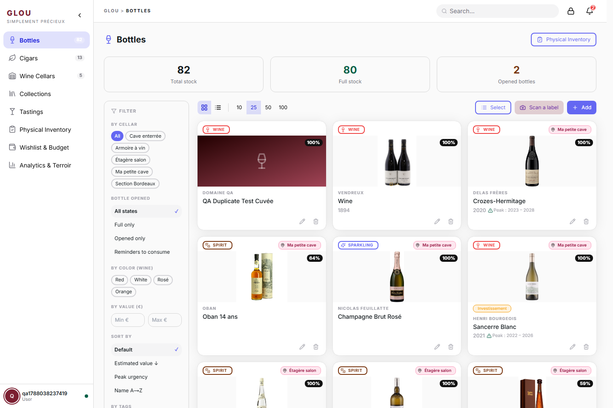
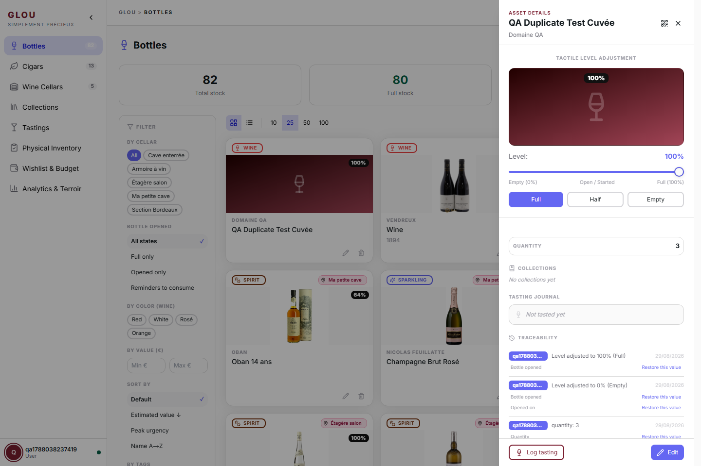
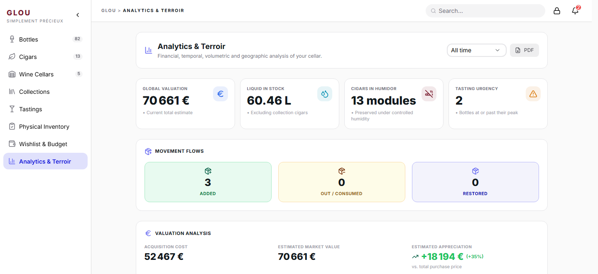

<div align="center">
  <h1>🍷 Glou</h1>
  <p><strong>Simply precious.</strong></p>
  <p>Glou is a self-hosted asset manager for luxury collections — wines, spirits, bubbles, and cigars. Visual recognition, expert data, and peak maturity indicators in one stack you fully own.</p>
</div>

---

## ✨ Top 5 Highlights
1. 📸 **Zero-Effort Intake**: Snap a label photo. OCR pre-fills the details instantly.
2. 🤝 **Shared Inventory**: Every user on the instance shares one collective cellar — built for families, roommates, and wine clubs.
3. 🧠 **Smart Data Engine**: Auto-enrichment via Vivino and Whiskybase, backed by a local cache.
4. 🔔 **Peak Maturity Alerts**: Get notified when a bottle enters its drinking window before it's too late.
5. 🛡️ **Fully Self-Hosted**: A Docker Compose stack (Node.js · Next.js · PostgreSQL) you run on your own machine.

---

## 📸 Screenshots

<table>
  <tr>
    <td width="50%"></td>
    <td width="50%"></td>
  </tr>
  <tr>
    <td align="center"><strong>Shared inventory dashboard</strong><br/><sub>Rich cards, faceted filters, and live stock stats.</sub></td>
    <td align="center"><strong>Item detail &amp; traceability</strong><br/><sub>Tactile fill level, tasting journal, and per-field history with one-click rollback.</sub></td>
  </tr>
  <tr>
    <td colspan="2"></td>
  </tr>
  <tr>
    <td colspan="2" align="center"><strong>Analytics &amp; Terroir</strong><br/><sub>Valuation, movement flows, drinking-window urgency, and a geographic view of your cellar.</sub></td>
  </tr>
</table>

---

## 🚀 Quick Start

**Prerequisites:**
- Docker installed and running.

**Step 1 — Configure**
```bash
cp .env.example .env
```
Open `.env` and set a strong `JWT_SECRET`.

> [!CAUTION]
> `JWT_SECRET` has no safe default. Running with the placeholder value makes all user sessions trivially forgeable. Generate one with: `openssl rand -hex 32`

**Step 2 — Launch**
```bash
docker compose up -d
```
Docker pulls the pre-built images and starts the stack. No compilation required.

**Step 3 — Create your account**

Open [http://localhost:3000](http://localhost:3000) and click **Register**. The first account you create is automatically granted admin privileges.

> [!TIP]
> To update to a new version: `docker compose pull && docker compose up -d`

*For advanced configuration, environment variables, and troubleshooting, see the [Wiki](./docs/wiki/EN/_wiki.md).*

---

## 🗺️ Roadmap

### ✅ Recently Added
- 🎓 **Expert / Collector Mode** — sommelier-grade tasting grid, appellation & cask fields, and the humidor panel on every item; a reversible per-user toggle.
- 📸 **Express Label Scanning** — a self-hosted, CPU-only vision model pre-fills name, producer, category, and vintage from a label photo.
- 🍽️ **Guided Food Pairing** — type a dish, get a ranked shortlist from your own cellar with one-click "drink it now".
- 📅 **Smart Consumption Plan** — a personal "drink now / drink soon" list from peak windows and rotation, plus a monthly goal.
- 🎁 **Wishlist & Budget Tracking** — price caps, observed-price deal alerts, and a spending envelope per period.
- 📴 **Trusted Offline Mode** — browse and edit loaded items offline; changes queue and auto-sync with conflict resolution.
- 🗺️ **World Map, Heatmap & Filters** — explore the collection geographically and filter by price, vintage, rating, or state.
- 💾 **Scheduled Backups & Data Portability** — nightly database backups with one-click restore, plus full or filtered exports.

Dozens of smaller features ship regularly — see the [closed pull requests](https://github.com/jackthomasanderson/glou-server/pulls?q=is%3Apr+is%3Aclosed) for the full history.

### 🔮 Next Up
- Predictive analytics for collection valuation.
- Advanced IoT integration for live cellar temperature and humidity monitoring.
- Native mobile companion application.
