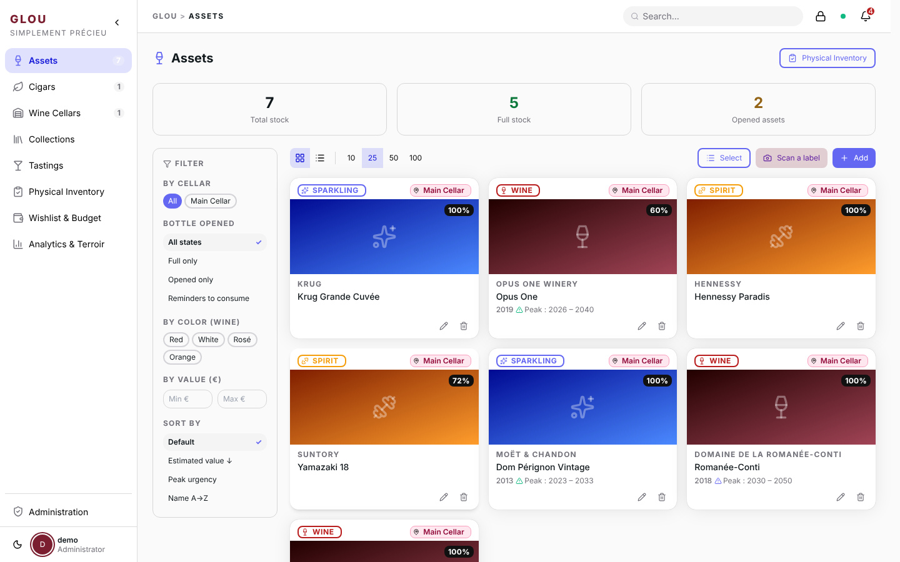
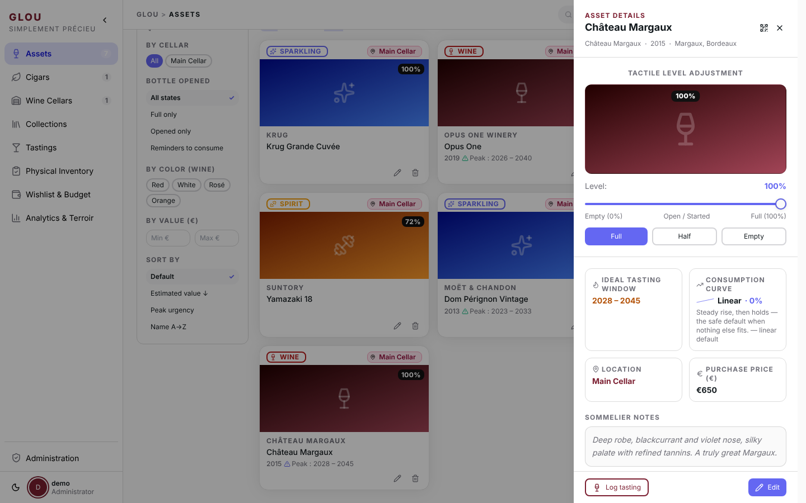
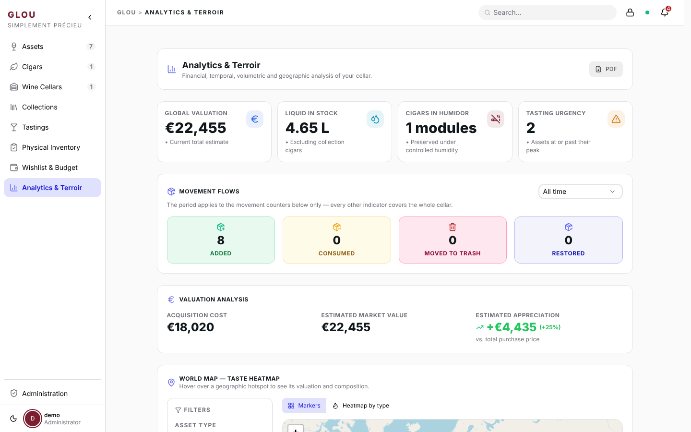

<div align="center">
  <h1>Glou</h1>
  <p><strong>Simply precious.</strong></p>
  <p>Glou is a self-hosted asset manager for luxury collections: wines, spirits, bubbles, and cigars. Label recognition, expert data, and peak maturity indicators in one stack you run yourself.</p>
</div>

---

## Top 5 highlights
1. Label intake: photograph a label and the scan pre-fills the details (the AI label scan is optional).
2. Shared inventory: every user on the instance shares one cellar, for families, roommates, and wine clubs. Sign-ups are closed once the admin exists; you decide when to open them.
3. Peak maturity alerts: you are notified when a bottle enters its drinking window.
4. Self-hosted: a Docker Compose stack (Node.js · Next.js · PostgreSQL) you run on your own machine.
5. Guest sharing: scoped, revocable links that let friends or family browse (or help stock) part of your cellar.

---

## Screenshots

<table>
  <tr>
    <td width="50%"></td>
    <td width="50%"></td>
  </tr>
  <tr>
    <td align="center"><strong>Shared inventory dashboard</strong><br/><sub>Cards, faceted filters, and live stock stats.</sub></td>
    <td align="center"><strong>Item detail &amp; traceability</strong><br/><sub>Fill level, tasting journal, and per-field history with rollback.</sub></td>
  </tr>
  <tr>
    <td colspan="2"></td>
  </tr>
  <tr>
    <td colspan="2" align="center"><strong>Analytics &amp; Terroir</strong><br/><sub>Valuation, movement flows, drinking-window urgency, and a geographic view of your cellar.</sub></td>
  </tr>
</table>

---

## Quick start

**Prerequisites:**
- Docker installed and running, on a 64-bit Intel/AMD or ARM host (Raspberry Pi 4/5, ARM NAS…): images are published for `linux/amd64` and `linux/arm64`.

**Step 1: Configure**
```bash
cp .env.example .env
```
Open `.env` and set three mandatory values, none of which has a safe default:
- `DB_PASSWORD`: docker compose refuses to start without it.
- `JWT_SECRET`: generate with: `openssl rand -base64 48`
- `CONFIG_ENCRYPTION_KEY`: generate with: `openssl rand -hex 32`

> [!CAUTION]
> Running with the placeholder values makes all user sessions trivially forgeable, and the API refuses to start in production mode until `CONFIG_ENCRYPTION_KEY` is a real value.

**Step 2: Launch**
```bash
# Linux only: the API runs as uid 1001 and writes nightly backups to ./backups.
# Create the folder first, or Docker creates it as root and every backup fails.
mkdir -p backups && sudo chown 1001:1001 backups
docker compose up -d
```
Docker pulls the pre-built images and starts the stack. No compilation required.

> [!NOTE]
> The AI label scan is optional and off by default (~9 GB of disk, ~3 GB of RAM). Enable it with `docker compose --profile scan up -d`.

**Step 3: Create your account**

Open [http://localhost:3000](http://localhost:3000) and click **Register**. The first account you create is automatically granted admin privileges.

> [!NOTE]
> Once that first account exists, **registration is closed**. To let other people sign up, an admin turns on **Allow new accounts to register** in **Administration → System Configuration → Network**, and can turn it off again afterwards.

> [!TIP]
> To update to a new version: `docker compose pull && docker compose up -d`. Back up first (**Administration → System Configuration → Backups → Run now**); to go back, see [Upgrade & Roll Back](./docs/wiki/EN/31-Upgrades-And-Rollback.md).

*For advanced configuration, environment variables, and troubleshooting, see the [Wiki](./docs/wiki/EN/_wiki.md).*

---

## Roadmap

### Recently added
- Expert / Collector mode: sommelier-grade tasting grid, appellation and cask fields, and the humidor panel on every item; a reversible per-user toggle.
- Label scanning: a self-hosted, CPU-only vision model pre-fills name, producer, category, and vintage from a label photo.
- Food pairing: type a dish, get a ranked shortlist from your own cellar with a "drink it now" button.
- Consumption plan: a personal "drink now / drink soon" list from peak windows and rotation, plus a monthly goal.
- Wishlist and budget tracking: price caps, observed-price deal alerts, and a spending envelope per period.
- Offline mode: browse and edit loaded items offline; changes queue and sync automatically with conflict resolution.
- World map, heatmap and filters: explore the collection geographically and filter by price, vintage, rating, or state.
- Scheduled backups and data portability: nightly database backups (on by default, missed runs caught up, failures reported to admins) with an all-or-nothing restore, plus a complete GDPR export, in full or filtered.
- Closed registration by default: only the first account (the admin) can sign up freely; an admin opens registration when needed.
- Keyboard and screen-reader access: keyboard-operable cellar grid, filters, tables and search, managed focus in drawers, announced errors.
- Safer operations: immutable commit-SHA image tags for rollback, a startup check of the required secrets, and guides for [secret rotation](./docs/wiki/EN/29-Secret-Rotation.md), [disaster recovery](./docs/wiki/EN/30-Disaster-Recovery.md) and [upgrades](./docs/wiki/EN/31-Upgrades-And-Rollback.md).

Dozens of smaller features ship regularly; see the [closed pull requests](https://github.com/jackthomasanderson/glou-server/pulls?q=is%3Apr+is%3Aclosed) for the full history.

### Next up
- Smart Data Engine: auto-enrichment via Vivino and Whiskybase, backed by a local cache. Not built yet: the admin screen's integration keys aren't read by anything today.
- Predictive analytics for collection valuation.
- Advanced IoT integration for live cellar temperature and humidity monitoring.
- Native mobile companion application.

## Credits / Third parties

- This product includes GeoLite data created by MaxMind, available from [http://maxmind.com/](http://maxmind.com/).
- Map tiles by [OpenStreetMap](https://www.openstreetmap.org/copyright) contributors.
