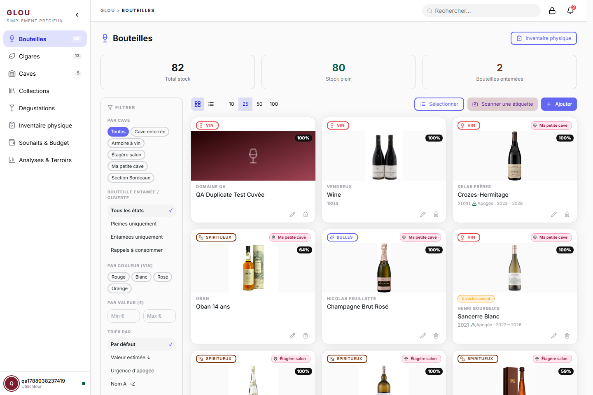
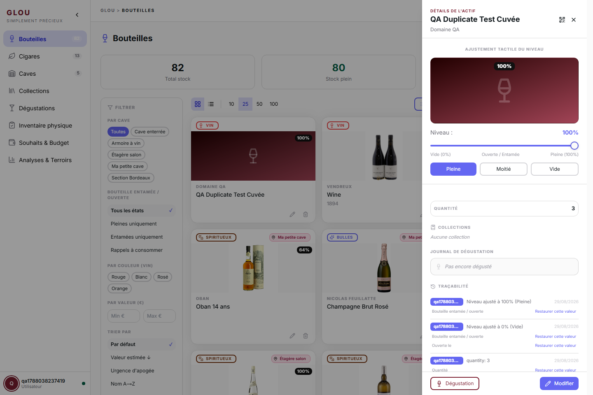
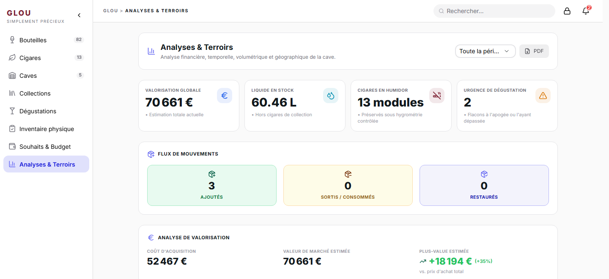

<div align="center">
  <h1>🍷 Glou</h1>
  <p><strong>Simplement précieux.</strong></p>
  <p>Glou est un gestionnaire d'actifs auto-hébergé pour collections de luxe — vins, spiritueux, bulles et cigares. Reconnaissance visuelle, données d'experts et indicateurs d'apogée dans une stack que vous maîtrisez entièrement.</p>
</div>

---

## ✨ Le Top 5
1. 📸 **Saisie Zéro Effort** : Photographiez une étiquette. L'OCR remplit les détails instantanément.
2. 🤝 **Inventaire Partagé** : Tous les utilisateurs de l'instance partagent une cave commune — parfait pour les familles, colocataires et clubs.
3. 🧠 **Smart Data Engine** : Enrichissement automatique via Vivino et Whiskybase, avec cache local.
4. 🔔 **Alertes Apogée** : Soyez notifié quand une bouteille entre dans sa fenêtre de dégustation optimale.
5. 🛡️ **Totalement Auto-Hébergé** : Une stack Docker Compose (Node.js · Next.js · PostgreSQL) que vous faites tourner chez vous.

---

## 📸 Captures d'écran

<table>
  <tr>
    <td width="50%"></td>
    <td width="50%"></td>
  </tr>
  <tr>
    <td align="center"><strong>Inventaire partagé</strong><br/><sub>Cartes détaillées, filtres à facettes et statistiques de stock en direct.</sub></td>
    <td align="center"><strong>Détail d'un actif &amp; traçabilité</strong><br/><sub>Niveau tactile, journal de dégustation et historique par champ avec restauration en un clic.</sub></td>
  </tr>
  <tr>
    <td colspan="2"></td>
  </tr>
  <tr>
    <td colspan="2" align="center"><strong>Analyses &amp; Terroir</strong><br/><sub>Valorisation, flux de mouvements, urgence de dégustation et vue géographique de votre cave.</sub></td>
  </tr>
</table>

---

## 🚀 L'Autoroute (Quick Start)

**Prérequis :**
- Docker installé et en cours d'exécution.

**Étape 1 — Configurer**
```bash
cp .env.example .env
```
Ouvrez `.env` et renseignez un `JWT_SECRET` robuste.

> [!CAUTION]
> `JWT_SECRET` n'a pas de valeur par défaut sûre. Utiliser la valeur d'exemple rend toutes les sessions utilisateurs falsifiables. Générez-en une avec : `openssl rand -hex 32`

**Étape 2 — Lancer**
```bash
docker compose up -d
```
Docker télécharge les images pré-construites et démarre la stack. Aucune compilation requise.

**Étape 3 — Créer votre compte**

Rendez-vous sur [http://localhost:3000](http://localhost:3000) et cliquez sur **S'inscrire**. Le premier compte créé reçoit automatiquement les droits administrateur.

> [!TIP]
> Pour mettre à jour vers une nouvelle version : `docker compose pull && docker compose up -d`

*Pour la configuration avancée, les variables d'environnement et le dépannage, consultez le [Wiki](./docs/wiki/FR/_wiki.md).*

---

## 🗺️ Roadmap & Prochaines Étapes

### 🏗️ En Cours (WIP)
Rien en chantier activement pour le moment — voir la section « À Venir » ci-dessous pour la suite.

### ✅ Récemment Ajouté
- 🎓 **Mode Expert / Collectionneur (FEAT-85)** : Un interrupteur dans votre profil qui révèle une grille de dégustation digne d'un sommelier, les champs appellation/classification, les détails de fût/batch, et le panneau de monitoring d'humidor — sur n'importe quel objet, pas seulement le vin ou les spiritueux, pour qu'une bouteille élevée en fût ou une boîte de cigares numérotée bénéficie du même traitement. C'est un réglage individuel — invisible pour le reste de la famille tant qu'elle ne l'active pas elle-même — et réversible à tout moment sans perdre la moindre valeur déjà saisie.
- 🌡️ **Suivi Hygrométrique d'Humidor & Alertes de Dérive (FEAT-15)** : Consignez à la main les relevés d'humidité de votre humidor, suivez la tendance sur un mini historique, et soyez alerté dès que votre dernier relevé sort de la plage que vous avez définie — la température peut aussi être notée, à titre purement indicatif. Saisie manuelle uniquement pour l'instant (pas de capteur physique supporté), réservé au Mode Expert.
- 📸 **Scan Express d'Étiquette (FEAT-04)** : Photographiez une étiquette et un modèle de vision auto-hébergé (Ollama avec `moondream`, sans cloud, sans GPU) pré-remplit nom, producteur, catégorie et millésime en quelques secondes — vérifiez et confirmez en trois gestes, enchaînez les scans pour tout un carton sans quitter l'appareil photo. La qualité de reconnaissance dépend de la netteté et de la luminosité de la photo : c'est un modèle léger auto-hébergé, pas un service spécialisé vin, donc vérifiez toujours avant d'enregistrer.
- 🍽️ **Accords Mets/Bouteilles Guidés (FEAT-09)** : Tapez un plat et obtenez une sélection classée de bouteilles de votre propre cave, avec un « consommer maintenant » en un clic qui enregistre la dégustation et met à jour le stock.
- 📅 **Plan de Consommation Intelligent & Rotation de Stock (FEAT-08)** : Une liste personnelle « à boire maintenant / prochainement » construite à partir des fenêtres d'apogée, des bouteilles entamées et de la rotation — plus un objectif mensuel dont vous suivez la progression.
- 🧮 **Inventaire Physique Assisté & Réconciliation (FEAT-12)** : Réalisez un comptage guidé par cave ou zone libre, mettez en pause et reprenez à tout moment, et corrigez chaque écart (manquant, inattendu, mal rangé) en un clic à la clôture.
- 🎁 **Liste de Souhaits & Pilotage Budgétaire (FEAT-20)** : Planifiez vos prochains achats avec un prix plafond, notez les prix observés pour repérer les bonnes affaires, et suivez une enveloppe budgétaire personnelle par période — basculez un souhait vers l'inventaire dès qu'il est acquis.
- 📴 **Mode Hors-Ligne de Confiance (FEAT-16/23)** : Consultez votre inventaire et modifiez les items déjà chargés même sans connexion — les changements se mettent en file localement et se synchronisent automatiquement au retour du réseau, avec un écran clair de résolution de conflit si le même item a changé entre-temps ailleurs. La création ou la suppression d'items nécessite toujours une connexion.
- 🧹 **Rétention & Maintenance Automatique des Données (FEAT-39)** : Définissez la durée de conservation des logs d'audit, sessions et invitations inutilisées, et laissez Glou les nettoyer chaque nuit tout seul — ou forcez un nettoyage à la demande et consultez exactement ce qui a été fait.
- 🌐 **Configuration de l'URL Publique & de l'Accès Réseau (FEAT-54)** : Indiquez à Glou comment il est joint depuis l'extérieur (direct ou derrière un reverse proxy) pour que chaque lien et partage généré reste correct, avec une vérification de cohérence en un clic.
- 🧭 **Assistant d'Onboarding Guidé (FEAT-56)** : Un parcours pas-à-pas à la première connexion — créez votre première cave et chargez vos premières bouteilles par scan d'étiquette, import CSV ou saisie manuelle, sans avoir à deviner quoi que ce soit.
- 🔎 **Transparence des Sources & Historique des Modifications (FEAT-05)** : Voyez exactement d'où vient chaque champ d'un actif et restaurez-le à une valeur antérieure en un clic — vos saisies manuelles priment toujours sur les suggestions automatiques.
- 💾 **Sauvegardes Planifiées & Portabilité des Données (FEAT-18)** : Sauvegardes automatiques nocturnes de la base restaurables en un clic, plus des exports complets ou filtrés par catégorie de toute votre collection quand vous le souhaitez.
- 🗺️ **Carte du Monde avec Géolocalisation (FEAT-40)** : Explorez toute votre collection sur une carte du monde interactive groupée par pays et région, avec un filtre par catégorie pour se concentrer sur les vins, spiritueux ou cigares.
- 🔥 **Heatmap par Type d'Actif (FEAT-41)** : Basculez la carte du monde en heatmap pour révéler quelles régions dominent votre collection pour un type choisi — vin, whisky, cigares, et plus.
- 🧮 **Filtres Avancés & Liste d'Actifs sur la Carte (FEAT-42)** : Affinez la carte du monde par prix, millésime, note ou état, puis cliquez directement depuis la liste filtrée vers la fiche détaillée de n'importe quel actif.
- 🔐 **Gestion des Sessions & Appareils de Confiance (FEAT-25)** : Consultez tous les appareils connectés à votre compte, déconnectez-en n'importe lequel à distance, et évitez de ressaisir votre code 2FA sur les appareils de confiance.
- 🚨 **Notifications de Sécurité (FEAT-29)** : Soyez alerté instantanément par email ou in-app en cas de nouvelle connexion, changement de mot de passe ou activation/désactivation du 2FA — avec un lien direct vers vos paramètres de sécurité.
- 🔒 **Verrouillage Rapide & Auto-Lock (FEAT-30)** : Verrouillez l'application en un clic ou laissez-la se verrouiller seule après inactivité, puis déverrouillez avec votre mot de passe ou un code PIN court — sans avoir à vous reconnecter.
- ✍️ **Partage Invité en Écriture (FEAT-37)** : Laissez des amis enregistrer des dégustations et mettre à jour les niveaux de remplissage sur les caves que vous partagez avec eux, sans leur créer de compte complet.
- 📸 **Visualisation Graphique des Items (FEAT-69)** : Image automatique dès que le nom et le producteur sont saisis (DuckDuckGo, stockage local). Photo en haut des cartes inventaire et en tête de fiche, à la Vivino. Remplacement via recherche manuelle, collage d'URL ou upload fichier.
- 🗺️ **Plan Visuel de Cave (FEAT-68)** : Vue en grille des emplacements de cave, drag & drop pour positionner les bouteilles, colorée par catégorie de produit.
- ✨ **Autocomplétion & Recherche d'Image (FEAT-66)** : Suggestions Google pour le nom et le producteur à la saisie — millésime extrait automatiquement.
- 🔍 **Recherche Globale (FEAT-64)** : Barre de recherche dans la navbar pour trouver instantanément n'importe quelle bouteille par nom, producteur, millésime ou catégorie.
- 🔗 **Détection de Doublons (FEAT-65)** : Avertissement automatique avant l'enregistrement si une bouteille identique existe déjà dans la cave.
- 📡 **Indicateur de Connectivité (FEAT-67)** : Statut internet en temps réel dans la navbar — les fonctions externes (autocomplétion, images) se dégradent gracieusement hors ligne.
- 👥 **Rôles & Contrôle d'Accès (FEAT-61)** : Les admins peuvent activer/désactiver les comptes avec effet immédiat (invalidation JWT en live) et consulter un journal d'audit paginé.
- 🔔 **Alertes Apogée (FEAT-06)** : Alertes automatiques quand une bouteille entre dans sa fenêtre de dégustation optimale.
- 🎨 **Profils & Personnalisation (FEAT-03)** : Thème, couleur d'accent, langue (FR/EN) et format de date — appliqués instantanément.
- 🏷️ **Gestion Contextuelle (FEAT-01)** : Création et édition adaptées au type d'actif (vins, bulles, spiritueux, cigares).
- 🔍 **Recherche Avancée & Filtres (FEAT-48)** : Retrouvez n'importe quelle bouteille par nom, producteur, millésime, catégorie ou cave en temps réel.
- 📦 **Actions Groupées & Modèles (FEAT-11)** : Mettez à jour votre cave en masse et sauvegardez des modèles pour automatiser vos routines.

### 🔮 À Venir
- Analyses prédictives pour la valorisation de la collection.
- Intégration IoT avancée pour le suivi en direct de la température et de l'hygrométrie.
- Application mobile native.
