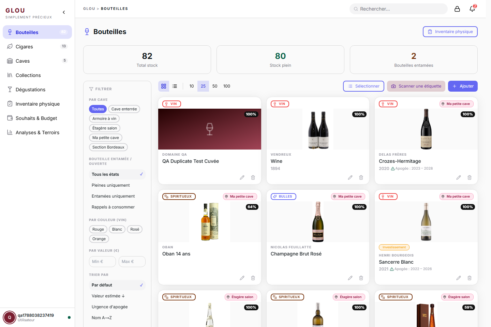
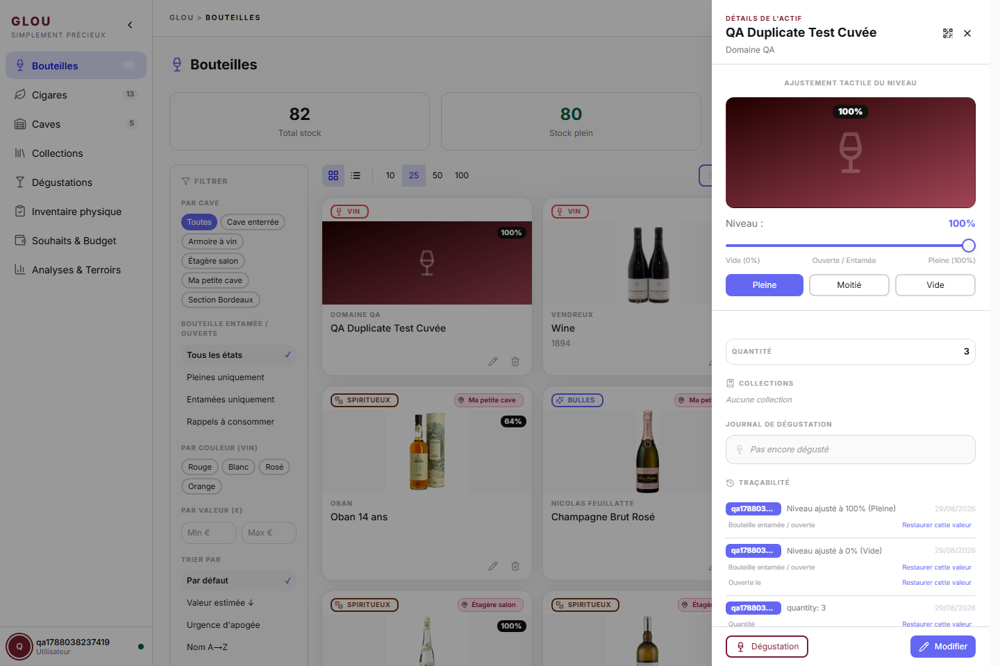
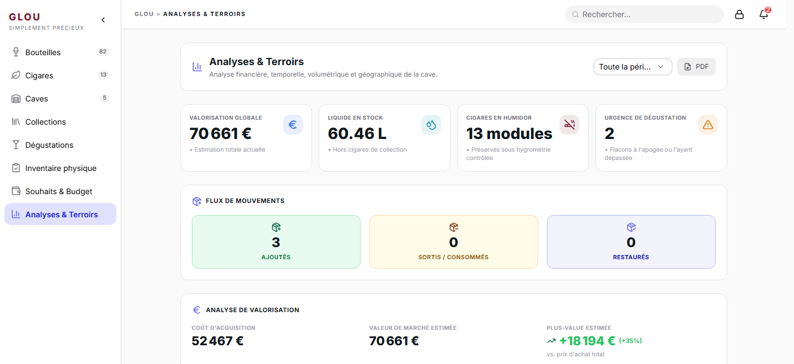

<div align="center">
  <h1>🍷 Glou</h1>
  <p><strong>Simplement précieux.</strong></p>
  <p>Glou est un gestionnaire d'actifs auto-hébergé pour collections de luxe — vins, spiritueux, bulles et cigares. Reconnaissance visuelle, données d'experts et indicateurs d'apogée dans une stack que vous maîtrisez entièrement.</p>
</div>

---

## ✨ Le Top 5
1. 📸 **Saisie Zéro Effort** : Photographiez une étiquette. L'OCR remplit les détails instantanément.
2. 🤝 **Inventaire Partagé** : Tous les utilisateurs de l'instance partagent une cave commune — parfait pour les familles, colocataires et clubs.
3. 🔔 **Alertes Apogée** : Soyez notifié quand une bouteille entre dans sa fenêtre de dégustation optimale.
4. 🛡️ **Totalement Auto-Hébergé** : Une stack Docker Compose (Node.js · Next.js · PostgreSQL) que vous faites tourner chez vous.
5. 👪 **Partage Invité** : Liens scopés et révocables pour laisser des proches consulter (ou aider à inventorier) une partie de votre cave.

---

## 📸 Captures d'écran

<table>
  <tr>
    <td width="50%"></td>
    <td width="50%"></td>
  </tr>
  <tr>
    <td align="center"><strong>Inventaire partagé</strong><br/><sub>Cartes détaillées, filtres à facettes et statistiques de stock en direct.</sub></td>
    <td align="center"><strong>Détail d'un actif &amp; traçabilité</strong><br/><sub>Niveau tactile, journal de dégustation et historique par champ avec restauration en un clic.</sub></td>
  </tr>
  <tr>
    <td colspan="2"></td>
  </tr>
  <tr>
    <td colspan="2" align="center"><strong>Analyses &amp; Terroir</strong><br/><sub>Valorisation, flux de mouvements, urgence de dégustation et vue géographique de votre cave.</sub></td>
  </tr>
</table>

---

## 🚀 L'Autoroute (Quick Start)

**Prérequis :**
- Docker installé et en cours d'exécution.

**Étape 1 — Configurer**
```bash
cp .env.example .env
```
Ouvrez `.env` et renseignez trois valeurs obligatoires — aucune n'a de valeur par défaut sûre :
- `DB_PASSWORD` — docker compose refuse de démarrer sans elle.
- `JWT_SECRET` — générez-en une avec : `openssl rand -base64 48`
- `CONFIG_ENCRYPTION_KEY` — générez-en une avec : `openssl rand -hex 32`

> [!CAUTION]
> Utiliser les valeurs d'exemple rend toutes les sessions utilisateurs falsifiables, et l'API refuse de démarrer en mode production tant que `CONFIG_ENCRYPTION_KEY` n'a pas une vraie valeur.

**Étape 2 — Lancer**
```bash
docker compose up -d
```
Docker télécharge les images pré-construites et démarre la stack. Aucune compilation requise.

> [!NOTE]
> Le scan d'étiquette par IA est optionnel et désactivé par défaut (~9 Go de disque, ~3 Go de RAM). Activez-le avec `docker compose --profile scan up -d`.

**Étape 3 — Créer votre compte**

Rendez-vous sur [http://localhost:3000](http://localhost:3000) et cliquez sur **S'inscrire**. Le premier compte créé reçoit automatiquement les droits administrateur.

> [!TIP]
> Pour mettre à jour vers une nouvelle version : `docker compose pull && docker compose up -d`

*Pour la configuration avancée, les variables d'environnement et le dépannage, consultez le [Wiki](./docs/wiki/FR/_wiki.md).*

---

## 🗺️ Roadmap

### ✅ Récemment Ajouté
- 🎓 **Mode Expert / Collectionneur** — grille de dégustation de sommelier, champs appellation et fût, et panneau humidor sur chaque objet ; un interrupteur individuel et réversible.
- 📸 **Scan Express d'Étiquette** — un modèle de vision auto-hébergé, sans GPU, pré-remplit nom, producteur, catégorie et millésime depuis une photo d'étiquette.
- 🍽️ **Accords Mets/Bouteilles Guidés** — tapez un plat, obtenez une sélection classée de votre propre cave avec un « consommer maintenant » en un clic.
- 📅 **Plan de Consommation Intelligent** — une liste personnelle « à boire maintenant / prochainement » à partir des apogées et de la rotation, plus un objectif mensuel.
- 🎁 **Liste de Souhaits & Budget** — prix plafonds, alertes bonnes affaires sur prix observés, et enveloppe budgétaire par période.
- 📴 **Mode Hors-Ligne de Confiance** — consultez et modifiez les items chargés hors connexion ; les changements se synchronisent automatiquement avec résolution de conflit.
- 🗺️ **Carte du Monde, Heatmap & Filtres** — explorez la collection géographiquement et filtrez par prix, millésime, note ou état.
- 💾 **Sauvegardes Planifiées & Portabilité** — sauvegardes nocturnes de la base restaurables en un clic, plus des exports complets ou filtrés.

Des dizaines de fonctionnalités plus petites sortent régulièrement — voir les [pull requests fermées](https://github.com/jackthomasanderson/glou-server/pulls?q=is%3Apr+is%3Aclosed) pour l'historique complet.

### 🔮 À Venir
- 🧠 **Smart Data Engine** — enrichissement automatique via Vivino et Whiskybase, avec cache local. Pas encore construit : les clés d'intégration de l'écran admin ne sont lues par aucun code aujourd'hui.
- Analyses prédictives pour la valorisation de la collection.
- Intégration IoT avancée pour le suivi en direct de la température et de l'hygrométrie.
- Application mobile native.

## 🙏 Crédits / Tiers

- Ce produit inclut des données GeoLite créées par MaxMind, disponibles sur [http://maxmind.com/](http://maxmind.com/).
- Fonds de carte par les contributeurs d'[OpenStreetMap](https://www.openstreetmap.org/copyright).
